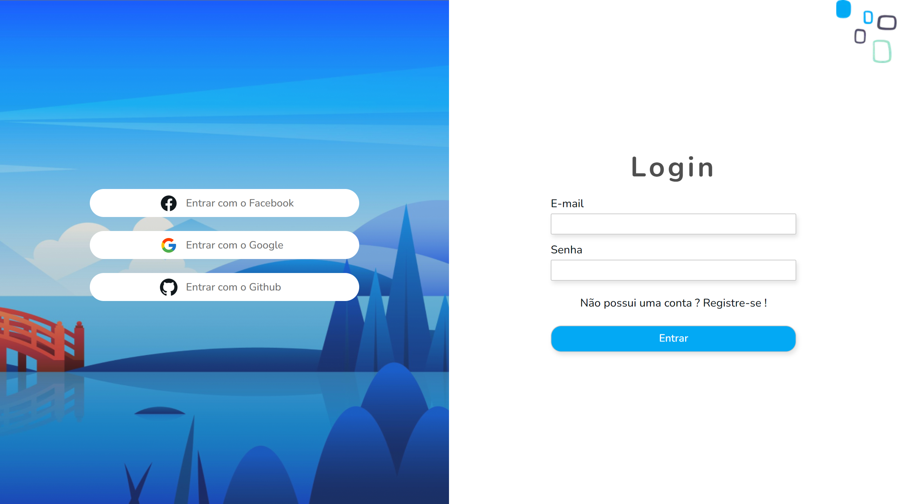

<h1 align="center">Dashboard (Front-end)</h1>

    

<h1 align="center">
    <a href="https://github.com/MarcoLGP/dashboard-api-public">🔗 Dashboard (Api)</a>
</h1>

🚀 Projeto dashboard

Tabela de conteúdos
=================
<!--ts-->
   * [Sobre](#Sobre)
   * [Aprendizado](#Aprendizado)
   * [🚧Responsividade🚧](#Responsividade)
   * [Considerações Finais](#Considerações-finais)
<!--te-->

<h1 id=="Sobre">Sobre</h1>

Projeto possui o intuito didático, sem fins lucrativos.

Registre-se e envie uma dica, sugestão, apoio para mim através da plataforma.

<h1 id="Aprendizado">Aprendizado</h1>

Através deste projeto exercitei bastante minha lógica, e para mim foi bastante desafiador, é um projeto relativamente grande e ainda não tive tempo de finalizar a responsividade.

Entrei em contato pela primeira vez com a tecnologia do Next.js e foi amor a primeira vista, está sendo para mim até então o framework que mais estou gostando de desenvolver.

<h1 id="Responsividade">🚧Responsividade🚧</h1>

Por se tratar de um projeto relativamente grande para uma pessoa, ainda não tive tempo de desenvolver a responsividade para aparelhos menores, futuramente com mais tempo planejo finalizar o projeto.

<h1 id="#Considerações-finais">Considerações finais</h1>

O usuário através da comunidade pode: escrever comentários, curtir e não curtir comentários, alterar sua foto, adicionar amigos, buscar novos amigos, saber o estado e o país de outros usuários através de geocoding reverse, entre outras mais coisas, tudo em tempo real !

